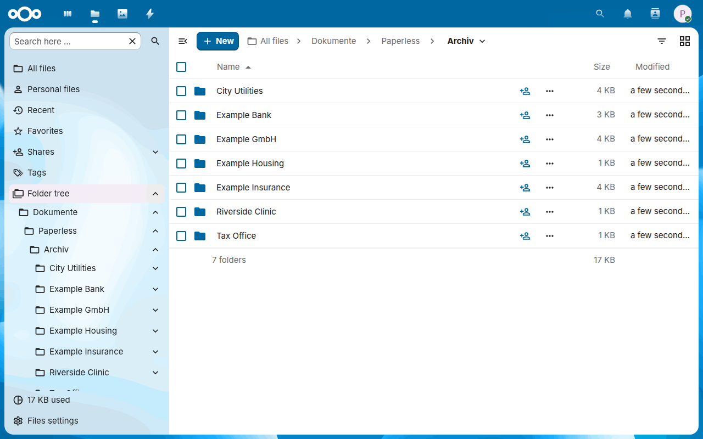
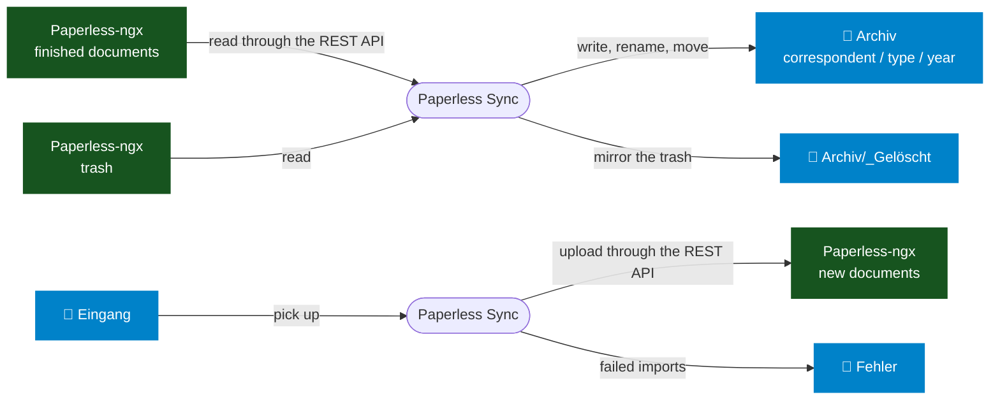
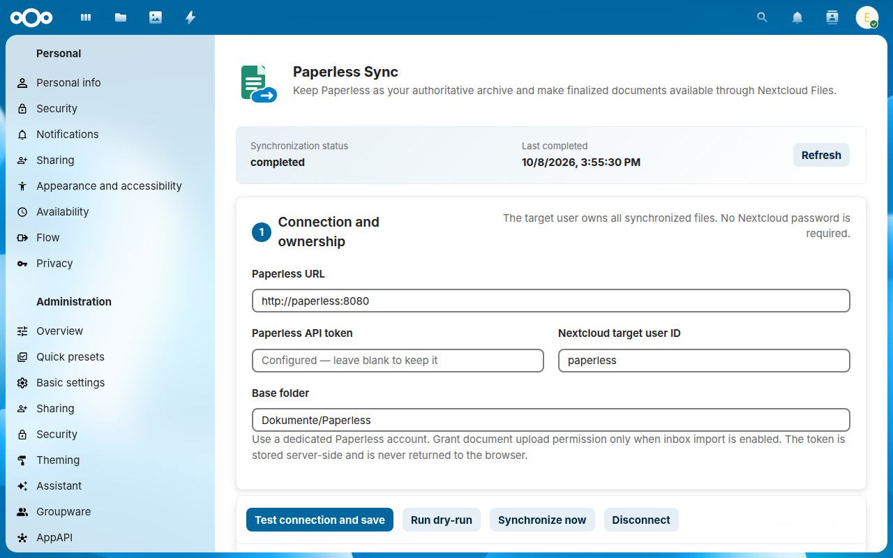
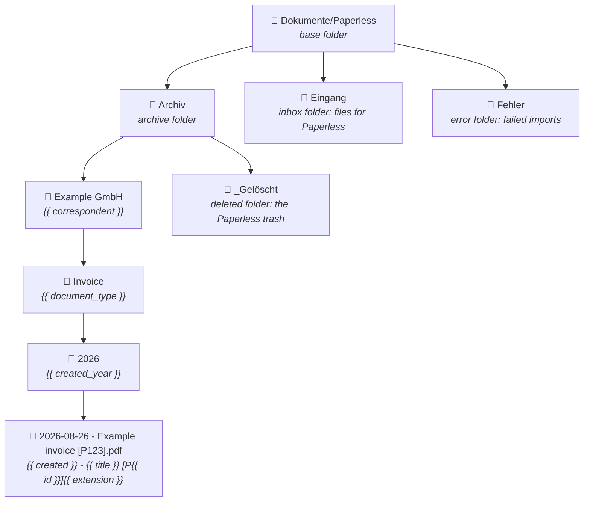
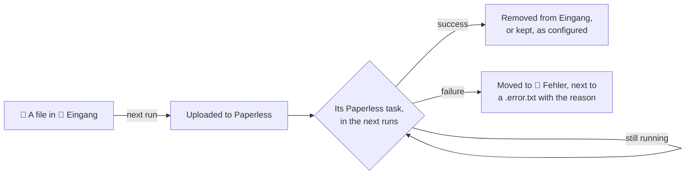
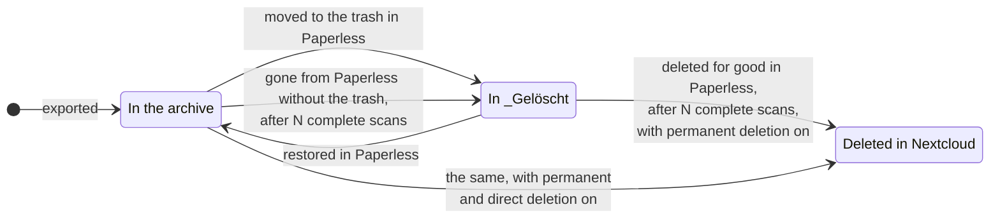

# Paperless Sync

[](https://dennis-otto.github.io/paperless-sync/)
[](https://github.com/Dennis-Otto/paperless-sync/actions/workflows/ci.yml)
[](https://github.com/Dennis-Otto/paperless-sync/actions/workflows/e2e.yml)
[](https://github.com/Dennis-Otto/paperless-sync/actions/workflows/secret-scan.yml)
[](https://github.com/Dennis-Otto/paperless-sync/actions/workflows/codeql.yml)
[](https://github.com/Dennis-Otto/paperless-sync/actions/workflows/sbom.yml)
[](https://scorecard.dev/viewer/?uri=github.com/Dennis-Otto/paperless-sync)
[](https://www.bestpractices.dev/projects/15277)
[](https://api.reuse.software/info/github.com/Dennis-Otto/paperless-sync)
[](https://github.com/sponsors/Dennis-Otto)

Paperless Sync is a native Nextcloud app that mirrors finalized Paperless-ngx documents into a structured Nextcloud archive and can optionally submit files from a Nextcloud inbox to Paperless.

Paperless remains the source of truth. Nextcloud provides convenient access through Files, desktop and mobile clients, sharing, and its viewer.



The [documentation website](https://dennis-otto.github.io/paperless-sync/) has this documentation as a guide, together with the architecture, the security design and the roadmap.

<sub>💛 If Paperless Sync is useful to you, you can [support its development](https://github.com/sponsors/Dennis-Otto).</sub>

[Quick start](#quick-start) · [Screenshots](#screenshots) · [Architecture](https://github.com/Dennis-Otto/paperless-sync/blob/main/docs/architecture.md) · [Security design](https://github.com/Dennis-Otto/paperless-sync/blob/main/docs/security.md) · [Roadmap](https://github.com/Dennis-Otto/paperless-sync/blob/main/docs/roadmap.md) · [Releases](https://github.com/Dennis-Otto/paperless-sync/blob/main/docs/releases.md) · [Changelog](https://github.com/Dennis-Otto/paperless-sync/blob/main/CHANGELOG.md)

<!-- --8<-- [start:how-it-works] -->

## How it works



At the configured interval, Nextcloud's cron starts a run of the app inside Nextcloud. It reads the finished documents of Paperless and writes each one into the archive of the Nextcloud user who owns it, at the path that the path template builds from its metadata. When the metadata changes in Paperless, the file moves; when a document goes to the Paperless trash, its copy goes to `_Gelöscht`. Files that someone puts into `Eingang` go the other way, to Paperless.

<!-- --8<-- [end:how-it-works] -->
<!-- --8<-- [start:quick-start-section] -->

## Quick start

<!-- --8<-- [start:quick-start] -->

1. Install **Paperless Sync** from the [Nextcloud App Store](https://apps.nextcloud.com/apps/paperless_sync) under *Apps*, or with `occ app:install paperless_sync`. Nextcloud's system cron must run.
2. In Paperless-ngx, create a dedicated account with view and download access to the documents to mirror, and an API token for it.
3. In Nextcloud, open **Administration settings → Paperless Sync**. Enter the Paperless URL, the token and the Nextcloud user who owns the archive, leave synchronization disabled, and save; saving tests the connection to Paperless and the folder in Nextcloud.
4. Start a **dry run** and read its summary: it lists what a run would change, without changing anything.
5. Enable synchronization and save. Nextcloud's cron runs it at the configured interval, and the documents appear in `Dokumente/Paperless/Archiv` of that user.

<!-- --8<-- [end:quick-start] -->
<!-- --8<-- [end:quick-start-section] -->
<!-- --8<-- [start:features] -->

## Features

- Native Nextcloud filesystem operations without WebDAV credentials
- Configurable target user and base, archive, inbox, error, and deleted folders
- Configurable archive path template
- Correspondent-first folder hierarchy by default
- Archive PDF or original-file export
- Metadata-aware renames and moves
- Paperless inbox detection and configurable excluded tags, including removal of previously mirrored copies
- Recursive Nextcloud inbox import with Paperless task tracking
- Paperless trash mirroring and optional permanent deletion
- Configurable missing-document confirmation runs
- Empty-folder pruning
- Conflict policy, batch size, and interval controls
- Dry-run, manual execution, status, and error summaries
- Server-side token storage through Nextcloud's credentials manager
- Automated semantic releases and signed App Store packages

<!-- --8<-- [end:features] -->

## Screenshots

Following the quick start: a dry-run lists every file that a run would write, move or delete, without changing anything, and *Synchronize now* makes the changes.


A few days later, a dry-run shows every kind of change at once: new documents, a new title, a document in the Paperless trash, one with an excluded tag and a finished import from the inbox.

<picture>
  <source media="(prefers-color-scheme: dark)" srcset="docs/images/report-dark.png">
  
</picture>

The archive in Files, one folder per correspondent, document type and year, with the ID of each document in its name:

<picture>
  <source media="(prefers-color-scheme: dark)" srcset="docs/images/archive-dark.png">
  
</picture>

The settings of the app in the administration settings of Nextcloud:

<picture>
  <source media="(prefers-color-scheme: dark)" srcset="docs/images/settings-dark.png">
  
</picture>

The [guide](https://dennis-otto.github.io/paperless-sync/guide.html#the-settings-section-by-section) shows every section of the settings.

<!-- --8<-- [start:usage] -->

## Usage

After installation, open **Administration settings → Paperless Sync**. Configure and test the connection while synchronization remains disabled. Run a dry-run, review the summary, and only then enable scheduled synchronization.

The default archive path template is:

```text
{{ correspondent }}/{{ document_type }}/{{ created_year }}/{{ created }} - {{ title }} [P{{ id }}]{{ extension }}
```

This produces paths such as:

```text
Dokumente/Paperless/Archiv/Example GmbH/Invoice/2026/2026-08-26 - Example invoice [P123].pdf
```

Each part of the template becomes a folder, and the base folder holds the folders of the inbox and of failed imports next to the archive:



Stable markers such as `[P123]` are compatible with the independent [Paperless Unified Search](https://github.com/Dennis-Otto/paperless-unified-search) app.

<!-- --8<-- [end:usage] -->
<!-- --8<-- [start:configuration] -->

## Configuration

### Paperless connection

Use a dedicated Paperless service account. It needs view and download access to every document that should be exported. Enable `documents.add_document` only when Nextcloud inbox import is used. Trash synchronization requires visibility of the corresponding trashed documents.

The API token is stored in Nextcloud's credentials manager and never returned to the browser.

### Folder ownership

The configured Nextcloud target user owns the synchronized folders. The app operates through Nextcloud's internal filesystem API and therefore does not need that user's password or an app password.

### Path template variables

- `{{ id }}`
- `{{ title }}`
- `{{ correspondent }}`
- `{{ document_type }}`
- `{{ storage_path }}`
- `{{ created }}`, `{{ created_year }}`, `{{ created_month }}`
- `{{ added }}`, `{{ added_year }}`
- `{{ original_filename }}`
- `{{ extension }}`

The template must contain `{{ id }}`. Path components are normalized and sanitized for Nextcloud, macOS, and Windows clients.

### Nextcloud inbox

Files in the inbox folder, and in its subfolders when *Scan inbox subfolders* is on, go to Paperless, at most as many in one run as the batch size allows. A file stays in the inbox until its Paperless task reports success:



A failed file keeps its subfolder below the error folder.

### Deletion safety

Moving Paperless documents to its trash can be mirrored into the configured `_Gelöscht` folder; when the trash behavior keeps archive files in place, the copy stays where it is. Permanent Nextcloud deletion is disabled by default. When enabled, a document must be absent from both the active Paperless API and its trash for the configured number of consecutive complete scans.



N is the number of *Required consecutive missing scans*, three by default. With the trash behavior *Keep archive file in place*, the copy stays in the archive instead of moving to `_Gelöscht`, and it is deleted from there when the rules allow it.

The copy of a document that disappears from Paperless without passing through its trash moves to the deleted folder after the same number of scans. It stays in place when the trash behavior keeps archive files in place, and it is deleted when direct deletion is allowed as well.

Only a copy that is still there is moved or deleted: a document whose copy is already gone, or that was never exported, is only marked as trashed or missing. Moves to the deleted folder and deletions count against the batch size like every other change: what does not fit into a run waits for the next one. A copy that cannot be moved or deleted is reported as an error of its document, and the run carries on with the others.

### Background jobs

The app uses Nextcloud's native cron scheduler. System cron must run reliably. The configured interval is enforced by the app; each run limits modifications to the configured batch size.

<!-- --8<-- [end:configuration] -->

## Testing

Unit tests cover path generation, state transitions, export, metadata moves, exclusions, trash handling, guarded deletion, inbox success and failure, dry-run behavior, and release version management.

The Docker end-to-end suite mounts this checkout into real Nextcloud containers and uses a deterministic Paperless API mock:

```bash
bash tests/e2e/run.sh
```

CI runs the suite against the current release of every Nextcloud version from `min-version` to `max-version` in `appinfo/info.xml`. See [`tests/e2e/README.md`](https://github.com/Dennis-Otto/paperless-sync/blob/main/tests/e2e/README.md) for details and [`tests/e2e/MANUAL_ACCEPTANCE_TESTS.md`](https://github.com/Dennis-Otto/paperless-sync/blob/main/tests/e2e/MANUAL_ACCEPTANCE_TESTS.md) for the release matrix.

## Development

Requirements: PHP 8.2+, Composer, Node.js and Docker; the dev container in `.devcontainer/` has them ready.

```bash
composer install
bash scripts/check.sh
bash tests/e2e/run.sh
```

The pictures of the documentation and of the App Store come from the same Docker setup, with a synthetic household archive; take them anew after a change of the interface:

```bash
bash tests/e2e/screenshots.sh
```

`scripts/check.sh` runs the checks of the CI: Composer, `appinfo/info.xml` against the schema of the App Store, PHP syntax, the coding standard, Psalm, PHPUnit, the package that krankerl builds with `scripts/check-package.sh`, and the JavaScript and the translations (`scripts/check-project.sh`).

The app ID is `paperless_sync` and the PHP namespace is `OCA\PaperlessSync`. Psalm analyzes the PHP code, CodeQL scans the JavaScript, and the SBOM workflow continuously inventories dependencies.

## Release process

The protected `main` branch requires the checks of the CI, the Docker end-to-end tests against every supported Nextcloud version, the dependency review, CodeQL, the secret scan, the licenses of every file (REUSE), the sign-off of every commit and a Conventional Commit title. Dependabot keeps the dependencies current; routine updates merge on their own once every check passes.

The release bot keeps a pull request for the next release. Its version follows from the titles of the merged pull requests, and what they wrote under *Unreleased* in `CHANGELOG.md` becomes its notes. Merging it publishes the release: the package, checked before and after signing with the app's certificate, its detached signature, an SPDX SBOM and signed build provenance, then the same package in the Nextcloud App Store, verified afterwards as users can verify it. See [the release guide](https://github.com/Dennis-Otto/paperless-sync/blob/main/docs/releases.md).

Project decisions and support expectations are documented in [GOVERNANCE.md](https://github.com/Dennis-Otto/paperless-sync/blob/main/GOVERNANCE.md), [SUPPORT.md](https://github.com/Dennis-Otto/paperless-sync/blob/main/SUPPORT.md), and [CODE_OF_CONDUCT.md](https://github.com/Dennis-Otto/paperless-sync/blob/main/CODE_OF_CONDUCT.md).

## License

AGPL-3.0-or-later
