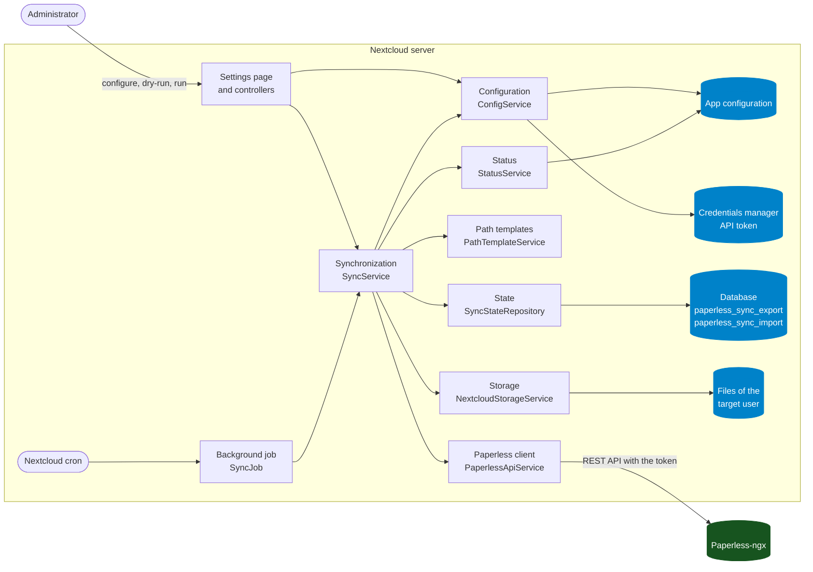
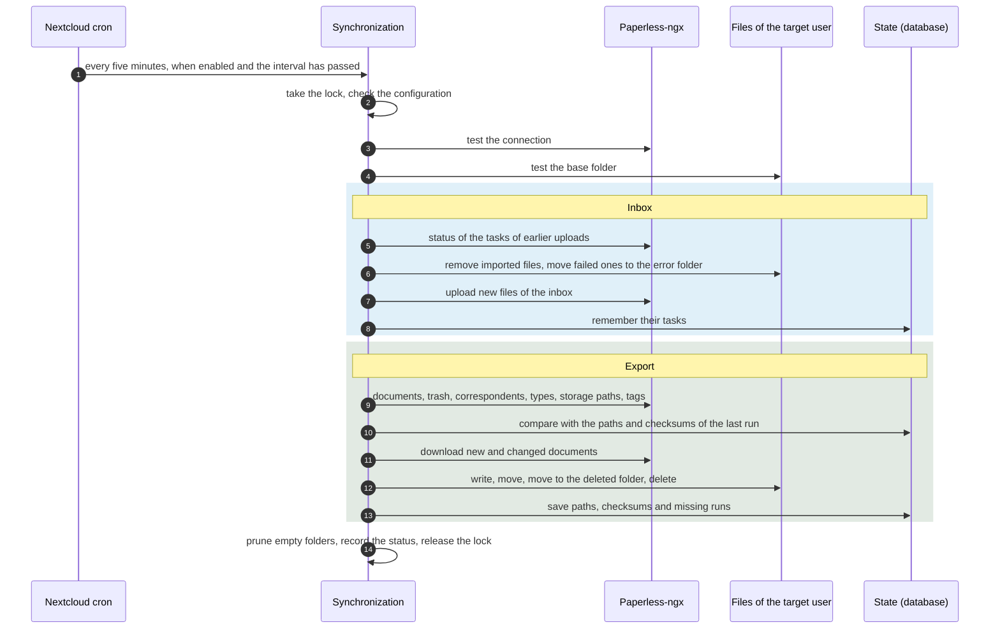

# Architecture

[← README](https://github.com/Dennis-Otto/paperless-sync) · [Security design](security.md) · [Roadmap](roadmap.md) · [Releases](releases.md)

Paperless Sync is a Nextcloud app in PHP. It runs inside Nextcloud, reads Paperless-ngx through its REST API and writes files through Nextcloud's file API. It has no server, daemon or port of its own.

## Components

| Component | Files | What it does |
| --- | --- | --- |
| Settings page | `lib/Settings/`, `templates/settings.php`, `js/settings.js` | The page under *Administration settings → Paperless Sync*: the configuration, a test of the connection, a dry run, a run by hand and the status of the last run |
| Controllers | `lib/Controller/` | The routes of the settings page: save, reset, run and status. Nextcloud lets only administrators call them and checks the CSRF token of every request |
| Configuration | `lib/Service/ConfigService.php`, `lib/Model/SyncConfig.php` | Checks every setting and stores it in the app configuration of Nextcloud; the API token goes to Nextcloud's credentials manager |
| Paperless client | `lib/Service/PaperlessApiService.php` | Reads documents, their metadata, tags and the trash, downloads files, uploads the files of the inbox and follows their tasks, through Nextcloud's HTTP client |
| Path templates | `lib/Service/PathTemplateService.php` | Turns the metadata of a document into its path, such as `Example GmbH/Invoice/2026/2026-08-26 - Example invoice [P123].pdf`, with every part cleaned for Nextcloud, macOS and Windows |
| Storage | `lib/Service/NextcloudStorageService.php` | Creates folders and writes, moves and deletes files below the base folder of the target user, through Nextcloud's file API |
| Synchronization | `lib/Service/SyncService.php` | One run: first the inbox, then the export with moves and renames, the trash and the guarded deletion; a lock keeps two runs apart |
| State | `lib/Service/SyncStateRepository.php`, `lib/Migration/` | Two tables in Nextcloud's database: `paperless_sync_export` with the path, checksum and missing runs of every exported document, and `paperless_sync_import` with every file of the inbox and its Paperless task |
| Background job | `lib/Cron/SyncJob.php` | Starts a run from Nextcloud's cron when synchronization is enabled and the configured interval has passed |
| Status | `lib/Service/StatusService.php`, `lib/Model/SyncReport.php` | The start, the end, the state, the summary and the last error of the latest run |

## Data flow

One run, from the background job to the status:

1. Nextcloud's cron starts the background job every five minutes. It runs only when synchronization is enabled and the configured interval has passed. An administrator can start a run or a dry run on the settings page as well.
2. The run takes a lock, checks that the app is configured, and tests the connection to Paperless and the base folder in Nextcloud.
3. **Inbox:** the files of the inbox folder are uploaded to Paperless, at most as many as the batch size allows. Their tasks are followed in the next runs: after success the file is deleted or kept, as configured; after a failure it moves to the error folder, next to a text file with the reason.
4. **Export:** every document gets its path from the path template. A new document is downloaded to a temporary file and then written; a document whose checksum changed is written again; a document whose metadata changed moves to its new path. Documents in the Paperless inbox and documents with an excluded tag are skipped, and their mirrored copies removed.
5. **Trash and deletion:** a document in the Paperless trash moves to the deleted folder. A document that is missing from both the API and the trash for the configured number of complete runs is deleted, but only when permanent deletion is enabled.
6. Empty folders are pruned, the state is saved, and the status records the report. A dry run does all of this without writing anything.

## Design decisions

- **Paperless is the source of truth.** Nextcloud gets a mirror; the app sends no change of the mirrored files back to Paperless.
- **The marker `[P<ID>]`** in every file name ties a file to its document, so a renamed document is found again, and [Paperless Unified Search](https://github.com/Dennis-Otto/paperless-unified-search) can open it.
- **No WebDAV and no password of Nextcloud.** The app writes through Nextcloud's file API in the name of the target user.
- **Bounded and resumable runs.** The batch size limits the changes of one run, and the state lets the next run continue where it stopped.
- **Safe by default.** Synchronization is off until a configuration works, and permanent deletion is off until an administrator turns it on.
