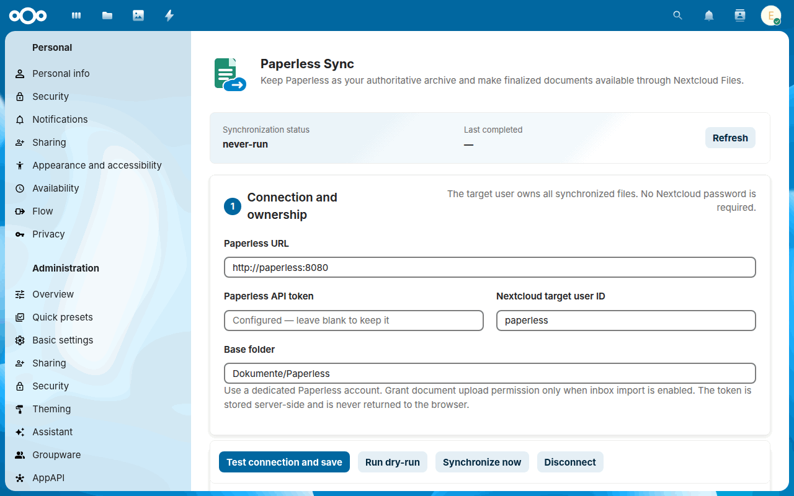
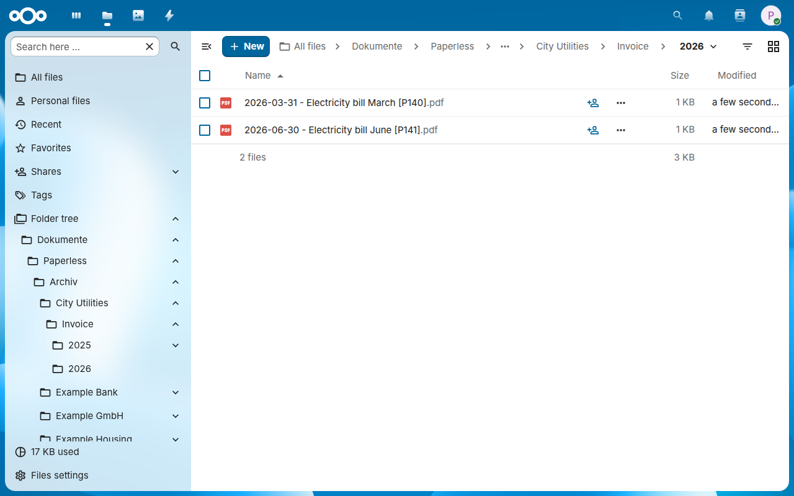
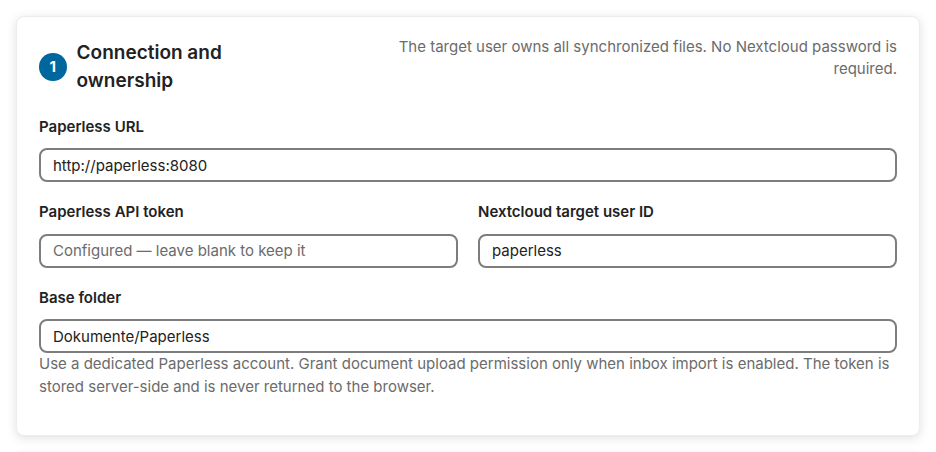
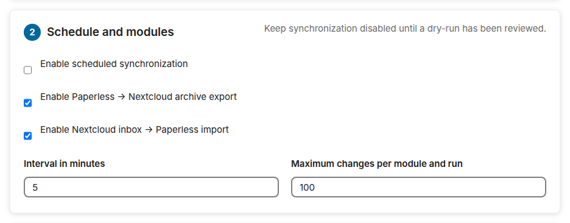
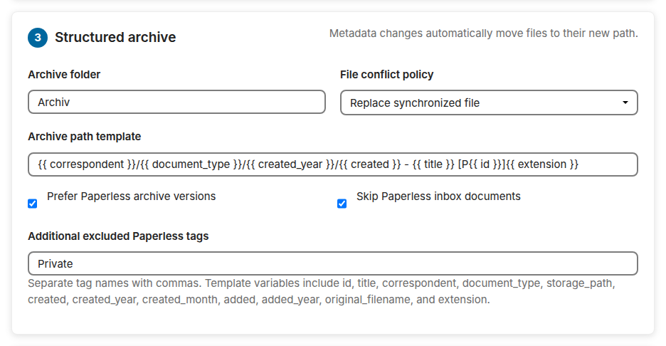
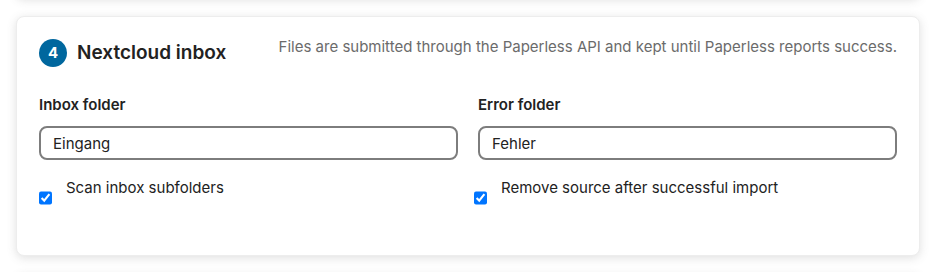
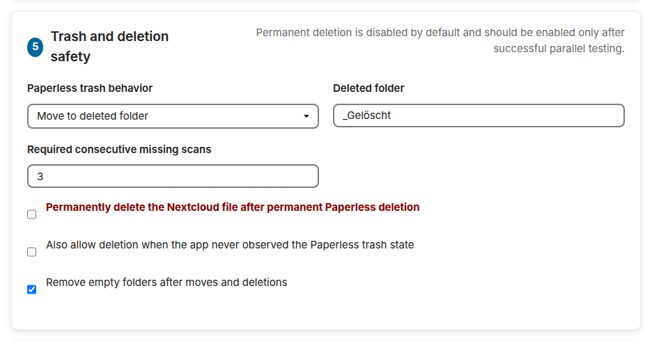
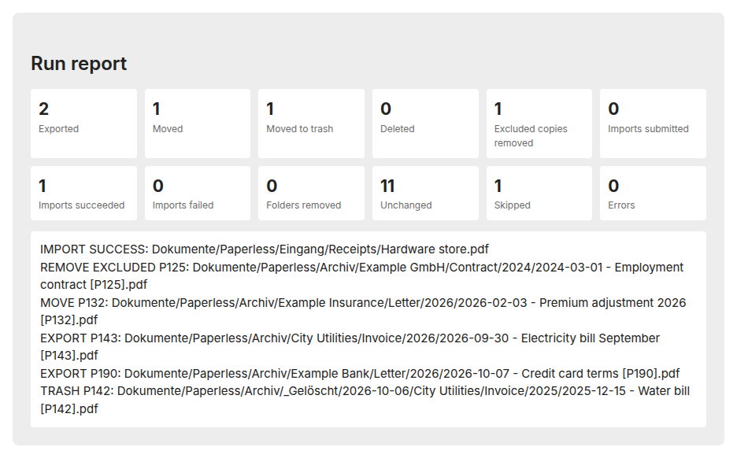

# Guide

How to install and set up Paperless Sync, what it does, how to use it, and what each part of its configuration means.

--8<-- "README.md:how-it-works"

--8<-- "README.md:quick-start-section"

The dry-run and the first synchronization of the quick start:

--8<-- "README.md:features"

--8<-- "README.md:usage"

The archive in Files, one folder per correspondent, document type and year:

<picture>
  <source media="(prefers-color-scheme: dark)" srcset="images/archive-dark.png">
  
</picture>

--8<-- "README.md:configuration"

## The settings, section by section

The settings are in **Administration settings → Paperless Sync**. Above the sections, the status shows the state and the end of the last run; below them, the buttons save the settings after a test of the connection, start a dry-run or a run, and disconnect Paperless.

**1 · Connection and ownership:** the address of Paperless, its API token, the Nextcloud user who owns the archive, and the base folder in the files of that user.

<picture>
  <source media="(prefers-color-scheme: dark)" srcset="images/settings-connection-dark.png">
  
</picture>

**2 · Schedule and modules:** the scheduled synchronization, the export to Nextcloud and the import from the inbox, each on its own, the interval, and the most changes of one run.

<picture>
  <source media="(prefers-color-scheme: dark)" srcset="images/settings-schedule-dark.png">
  
</picture>

**3 · Structured archive:** the archive folder, what happens when a file is in the way, the path template, the archive version or the original, and which documents stay out.

<picture>
  <source media="(prefers-color-scheme: dark)" srcset="images/settings-archive-dark.png">
  
</picture>

**4 · Nextcloud inbox:** the inbox folder, the error folder, the subfolders of the inbox, and whether an imported file leaves the inbox.

<picture>
  <source media="(prefers-color-scheme: dark)" srcset="images/settings-inbox-dark.png">
  
</picture>

**5 · Trash and deletion safety:** what a document in the Paperless trash does to its copy, the deleted folder, the scans before a missing document counts as gone, and the switches of permanent deletion.

<picture>
  <source media="(prefers-color-scheme: dark)" srcset="images/settings-deletion-dark.png">
  
</picture>

## The report of a run

A dry-run or a run by hand ends with its report: how many documents each kind of change concerned, and for a dry-run a line for every file that a run would write, move or delete. A file of the inbox that Paperless refuses appears once, as `IMPORT REJECTED` with the reason of Paperless, and counts as a failed import; until it changes, the runs after it count it as skipped. This dry-run comes a few days after the first synchronization, when Paperless has two new documents, a new title, a document in its trash, one with the excluded tag *Private* and a finished import:

<picture>
  <source media="(prefers-color-scheme: dark)" srcset="images/report-dark.png">
  
</picture>
